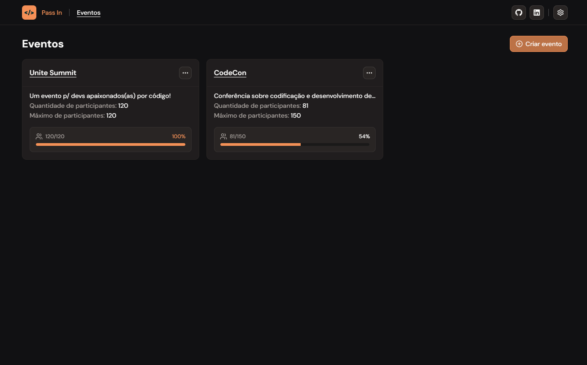

# Pass In 

> O Pass In é um sistema de check-in para eventos presenciais, permitindo que organizadores controlem e gerenciem a lista de participantes, enquanto os participantes podem gerar suas credenciais de acesso ao evento.

## Funcionalidades

1. **Eventos**: Organizadores podem cadastrar novos eventos fornecendo informações como título, detalhes e limite máximo de participantes. É possível também a exclusão de um evento.
2. **Gestão de participantes**: Os organizadores podem visualizar, pesquisar e excluir participantes.  
3. **Inscrição em eventos**: Os participantes podem se inscrever em eventos preenchendo um formulário com seu nome e e-mail.
4. **Check-in**: No dia do evento, os participantes podem realizar o check-in de maneira simples.

## Tecnologias utilizadas

- React Router Dom
- React Hook Form
- Axios
- TanStack Query
- TanStack Table
- Zod
- Tailwind CSS
- Shadcn UI
- Back-end em Node.js: [**Visitar repositório**](https://github.com/thiagop90/pass-in-api)

## Contribuição

Sinta-se à vontade para contribuir! Você pode reportar bugs, sugerir alterações na API, propor melhorias ou novas features abrindo uma issue.